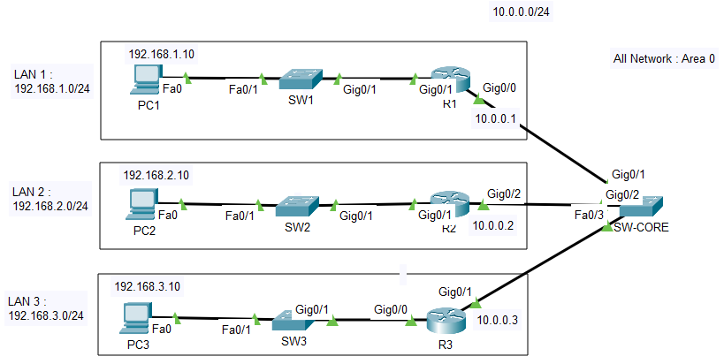

# 🌐 OSPF Single-Area Configuration with Transit Network (Area 0)

[](https://opensource.org/licenses/MIT)
[](https://obkworks.com)
[](https://obkworks.com)

> Hands-on Cisco networking lab implementing OSPFv2 dynamic routing in a single area (Area 0) to establish full end-to-end connectivity between three isolated LANs via a central backbone switch.

---

## ℹ️ Overview

In this networking lab, we cover how to configure **OSPFv2 dynamic routing** in a single area (**Area 0**). The goal of this topology is to establish full end-to-end routing between three isolated LANs using dedicated routers linked through a central backbone switch (`SW-CORE`).

---

## 🖼️ Network Topology

<p align="center">
  
</p>

---

## 📚 1. Fundamental OSPF Concepts

- **Link-State Protocol:** OSPF is a link-state routing protocol that calculates the shortest path to destinations based on full topology visibility using the Dijkstra (SPF) algorithm.
- **Wildcard Mask:** OSPF network commands use a wildcard mask (the inverse of a subnet mask). For a `/24` network (`255.255.255.0`), the corresponding wildcard mask is `0.0.0.255`.
- **Area Concept (Area 0):** All routers in this topology belong to **Area 0** (Backbone Area), which acts as the core transit area for inter-network traffic.
- **DR / BDR Election:** On multi-access broadcast networks (such as the `SW-CORE` switch segment), OSPF elects a Designated Router (DR) and Backup Designated Router (BDR) to optimize Link-State Advertisement (LSA) exchanges.

---

## 📐 2. IP Addressing Scheme

| Network / Segment      |  Subnet / CIDR   | Router Interface IP                                                | Client Host IP          | Default Gateway |
| :--------------------- | :--------------: | :----------------------------------------------------------------- | :---------------------- | :-------------- |
| **LAN 1**              | `192.168.1.0/24` | **R1:** `192.168.1.1`                                              | **PC1:** `192.168.1.10` | `192.168.1.1`   |
| **LAN 2**              | `192.168.2.0/24` | **R2:** `192.168.2.1`                                              | **PC2:** `192.168.2.10` | `192.168.2.1`   |
| **LAN 3**              | `192.168.3.0/24` | **R3:** `192.168.3.1`                                              | **PC3:** `192.168.3.10` | `192.168.3.1`   |
| **Backbone (SW-CORE)** |  `10.0.0.0/24`   | **R1:** `10.0.0.1` <br> **R2:** `10.0.0.2` <br> **R3:** `10.0.0.3` | N/A                     | N/A             |

---

## 🔌 3. Physical Connections Table

| Source Device | Source Port         | Destination Device | Destination Port    | Link Type                             |
| :------------ | :------------------ | :----------------- | :------------------ | :------------------------------------ |
| **PC1**       | FastEthernet 0      | **SW1**            | FastEthernet 0/2    | Local LAN Link (Straight-Through)     |
| **SW1**       | FastEthernet 0/1    | **R1**             | GigabitEthernet 0/0 | Local LAN Link (Straight-Through)     |
| **PC2**       | FastEthernet 0      | **SW2**            | FastEthernet 0/2    | Local LAN Link (Straight-Through)     |
| **SW2**       | FastEthernet 0/1    | **R2**             | GigabitEthernet 0/0 | Local LAN Link (Straight-Through)     |
| **PC3**       | FastEthernet 0      | **SW3**            | FastEthernet 0/2    | Local LAN Link (Straight-Through)     |
| **SW3**       | FastEthernet 0/1    | **R3**             | GigabitEthernet 0/0 | Local LAN Link (Straight-Through)     |
| **R1**        | GigabitEthernet 0/1 | **SW-CORE**        | FastEthernet 0/1    | OSPF Backbone Link (Straight-Through) |
| **R2**        | GigabitEthernet 0/1 | **SW-CORE**        | FastEthernet 0/2    | OSPF Backbone Link (Straight-Through) |
| **R3**        | GigabitEthernet 0/1 | **SW-CORE**        | FastEthernet 0/3    | OSPF Backbone Link (Straight-Through) |

---

## ⚙️ 4. Routers Configuration (R1, R2, R3)

```cisconetworking
! =========================================
! Router R1 Configuration
! =========================================
R1# configure terminal
R1(config)# interface GigabitEthernet 0/0
R1(config-if)# ip address 192.168.1.1 255.255.255.0
R1(config-if)# no shutdown
R1(config-if)# exit

R1(config)# interface GigabitEthernet 0/1
R1(config-if)# ip address 10.0.0.1 255.255.255.0
R1(config-if)# no shutdown
R1(config-if)# exit

R1(config)# router ospf 1
R1(config-router)# router-id 1.1.1.1
R1(config-router)# network 192.168.1.0 0.0.0.255 area 0
R1(config-router)# network 10.0.0.0 0.0.0.255 area 0
R1(config-router)# end
R1# write memory

! =========================================
! Router R2 Configuration
! =========================================
R2# configure terminal
R2(config)# interface GigabitEthernet 0/0
R2(config-if)# ip address 192.168.2.1 255.255.255.0
R2(config-if)# no shutdown
R2(config-if)# exit

R2(config)# interface GigabitEthernet 0/1
R2(config-if)# ip address 10.0.0.2 255.255.255.0
R2(config-if)# no shutdown
R2(config-if)# exit

R2(config)# router ospf 1
R2(config-router)# router-id 2.2.2.2
R2(config-router)# network 192.168.2.0 0.0.0.255 area 0
R2(config-router)# network 10.0.0.0 0.0.0.255 area 0
R2(config-router)# end
R2# write memory

! =========================================
! Router R3 Configuration
! =========================================
R3# configure terminal
R3(config)# interface GigabitEthernet 0/0
R3(config-if)# ip address 192.168.3.1 255.255.255.0
R3(config-if)# no shutdown
R3(config-if)# exit

R3(config)# interface GigabitEthernet 0/1
R3(config-if)# ip address 10.0.0.3 255.255.255.0
R3(config-if)# no shutdown
R3(config-if)# exit

R3(config)# router ospf 1
R3(config-router)# router-id 3.3.3.3
R3(config-router)# network 192.168.3.0 0.0.0.255 area 0
R3(config-router)# network 10.0.0.0 0.0.0.255 area 0
R3(config-router)# end
R3# write memory
```

---

## 🔀 5. Switches Configuration

```
! Enable interfaces on Access Switches (SW1, SW2, SW3)
SW1# configure terminal
SW1(config)# interface range FastEthernet 0/1 - 2
SW1(config-if-range)# no shutdown
SW1(config-if-range)# end
SW1# write memory

! Enable interfaces on Central SW-CORE Switch
SW-CORE# configure terminal
SW-CORE(config)# interface range FastEthernet 0/1 - 3
SW-CORE(config-if-range)# no shutdown
SW-CORE(config-if-range)# end
SW-CORE# write memory
```

---

## 🔍 6. Verification & Testing

1. Verify OSPF Routes on R1:

```
R1# show ip route ospf
```

Verify that 192.168.2.0/24 and 192.168.3.0/24 appear as OSPF (O) routes.

2. Verify OSPF Adjacency / Neighbor States:

```
R1# show ip ospf neighbor
```

Confirm neighbor states are in the FULL state.

3. Verify Local Gateway Reachability:

```
PC1> ping 192.168.1.1
```

4. Verify End-to-End Inter-LAN Connectivity:

```
PC1> ping 192.168.2.10
PC1> ping 192.168.3.10
```

---

## ⚠️ 7. Common Pitfalls & Troubleshooting

1. Missing Default Gateway: Client PCs must have their respective router LAN interface IP assigned as the Default Gateway.

2. Incorrect Wildcard Mask: Ensure the wildcard mask 0.0.0.255 is used for /24 subnets (not 255.255.255.0).

3. Administrative Shutdown: Always verify no shutdown has been applied to both physical interfaces and switch ports.

4. Area Mismatch: All network statements across all routers must specify area 0 for single-area communication.

---

## 🏁 8. Technical Conclusion

1. OSPF is an essential link-state routing protocol for enterprise networks due to its rapid convergence and high scalability. In this lab, three isolated LANs were successfully interconnected using Single-Area OSPF (Area 0).

2. Proper host Default Gateway configuration combined with precise wildcard network statements in the OSPF process guarantees robust and seamless inter-subnet communication across the backbone infrastructure.

🔗 Live Portfolio Demo: Coming soon

📄 License: MIT License — © 2026 obkWorks
